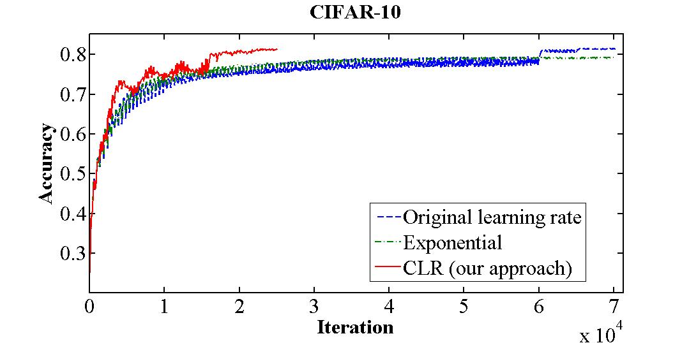

Fastai provides two methods to train/fit a model: [`.fit()`](https://docs.fast.ai/basic_train.html#Learner.fit) and [`.fit_one_cycle()`](https://docs.fast.ai/basic_train.html#fit_one_cycle). It is recommended to use the latter due to its better performance in speed and accuracy. But, how does it work?

`fit_one_cycle()` implements Leslie Smith's **1cycle learning rate policy**. Smith developed and published this methodology over three papers:

1. [Cyclical Learning Rates for Training Neural Networks](http://arxiv.org/abs/1506.01186) (2015)
2. [Super-Convergence: Very Fast Training of Neural Networks Using Large Learning Rates](http://arxiv.org/abs/1708.07120) (2017)
3. [A disciplined approach to neural network hyper-parameters: Part 1 -- learning rate, batch size, momentum, and weight decay](http://arxiv.org/abs/1803.09820) (2018)

A method that uses higher learning rates leading to quicker model training with higher accuracy.

It was developed by

1. The problem
   1. List most important hyper-parameters and how the relate to one another
   1. Small vs large LR (grid-search to find the right LR)
   1. LR schedules
   1. Adaptive LR using Adagrad, Adadelta, RMSprop, Adam (they work but computationally expensive)

The potential benefits of CLR can be seen in Figure
1, which shows the test data classification accuracy of the CIFAR-10 dataset during training1. The baseline (blue curve) reaches a final accuracy of 81.4% after 70, 000 it- erations. In contrast, it is possible to fully train the network using the CLR method instead of tuning (red curve) within 25,000 iterations and attain the same accuracy.

In these situations the network can be trained quickly with one learning rate cycle by using an unusually large learning rate. The very large learning rates used provided the twin benefits of regularization that prevented overfitting and faster training of the network. Figure 5a shows an example of super-convergence, where the training was completed in 10,000 iterations by using learning rates up to 3.0 instead of needing 80,000 iterations with a constant initial learning rate of 0.1.

CLR is A methodology for setting the global learning rates for training neural networks that eliminates the need to perform numerous experiments to find the best values and schedule with essentially no additional computation. Allowing the learning rate to rise and fall is beneficial overall even though it might temporarily harm the network’s performance.

Training a deep neural network is a difficult global optimization problem.

It is well known that too small a learning rate will make a training algorithm converge slowly while too large a learning rate will make the training algorithm diverge.

- Choosing a proper learning rate can be difficult. A learning rate that is too small leads to painfully slow convergence, while a learning rate that is too large can hinder convergence and cause the loss function to fluctuate around the minimum or even to diverge.
- Learning rate schedules [18] try to adjust the learning rate during training by e.g. annealing, i.e. reducing the learning rate according to a pre-defined schedule or when the change in objective between epochs falls below a threshold. These schedules and thresholds, however, have to be defined in advance and are thus unable to adapt to a dataset’s characteristics [4].

Triangular learning rate policy. The blue lines represent learning rate values changing between bounds. The input parame- ter stepsize is the number of iterations in half a cycle.

An intuitive understanding of why CLR methods work comes from considering the loss function topology. Dauphin et al. [4] argue that the difficulty in minimizing the loss arises from saddle points rather than poor local minima. Saddle points have small gradients that slow the learning process. However, increasing the learning rate allows more rapid traversal of saddle point plateaus. A more practical reason as to why CLR works is that, by following the meth- ods in Section 3.3, it is likely the optimum learning rate will be between the bounds and near optimal learning rates will be

The LR range test can be used to determine if super-convergence is possible for an architecture. In the LR range test, training starts with a zero or very small learning rate which is slowly increased linearly throughout a pre-training run. This provides information on how well the network can be trained over a range of learning rates.

The highest accuracies attained using standard learning rate schedules are listed in Table 6 and super-convergence test accuracy is 1.2%, 5.2%, and 9.2% better for 50,000, 20,000, and 10,000 training cases, respectively. Hence, super-convergence becomes more beneficial when training data is more limited.

Hence, one must experiment with a variety of learning rates and schedules. Conventional wisdom dictates that the learning rate should be a single value that monotonically decreases during training. This paper demonstrates the surprising phe- nomenon that a varying learning rate during training is ben- eficial overall and thus proposes to let the global learning rate vary cyclically within a band of values instead of set- ting it to a fixed value. In addition, this cyclical learning rate (CLR) method practically eliminates the need to tune the learning rate yet achieve near optimal classification accu- racy. Furthermore, unlike adaptive learning rates, the CLR methods require essentially no additional computation.

Adaptive learning rates: Adaptive learning rates can be considered a competitor to cyclical learning rates because one can rely on local adaptive learning rates in place of global learning rate experimentation but there is a signifi- cant computational cost in doing so. CLR does not possess this computational costs so it can be used freely.

Learning Rate (LR) is a crucial hyper-parameter to tune when training Deep Neural Networks (DNNs).

It is known that the learning rate is the most important
hyper-parameter to tune for training deep neural networks. This paper describes a new method for setting the learning rate, named cyclical learning rates, which practically elim- inates the need to experimentally find the best values and schedule for the global learning rates. Instead of mono- tonically decreasing the learning rate, this method lets the learning rate cyclically vary between reasonable bound- ary values. Training with cyclical learning rates instead of fixed values achieves improved classification accuracy without a need to tune and often in fewer iterations. This paper also describes a simple way to estimate “reasonable bounds” – linearly increasing the learning rate of the net- work for a few epochs. In addition, cyclical learning rates are demonstrated on the CIFAR-10 and CIFAR-100 datasets with ResNets, Stochastic Depth networks, and DenseNets, and the ImageNet dataset with the AlexNet and GoogLeNet architectures. These are practical tools for everyone who trains neural networks.

Learning rates are the most important hyper-parameter to set properly and can significantly affect the performance of your trained network. Common practice is to set the learning rate to a constant value and decrease it by an order of magnitude once the accuracy has plateaued. If one uses an initial constant learning rate that is larger or smaller than the optimal learning rate, then the network’s performance is degraded but the only way to find an optimal learning rate was to perform a grid search over possible learning rates. This was a tedious and time consuming process. My thought was to let the learning rate vary between a minimum and maximum learning rate value during the course of the training. It seemed easier to choose a range in the vicinity of the optimal learning rate than to find the optimal learning rate directly. Since the learning rate changes between these bounds, it spends part of the training close to the optimal value.

Although deep learning has produced dazzling successes for applications of im- age, speech, and video processing in the past few years, most trainings are with suboptimal hyper-parameters, requiring unnecessarily long training times. Setting the hyper-parameters remains a black art that requires years of experience to ac- quire. This report proposes several efficient ways to set the hyper-parameters that significantly reduce training time and improves performance. Specifically, this report shows how to examine the training validation/test loss function for subtle clues of underfitting and overfitting and suggests guidelines for moving toward the optimal balance point. Then it discusses how to increase/decrease the learning rate/momentum to speed up training. Our experiments show that it is crucial to balance every manner of regularization for each dataset and architecture. Weight decay is used as a sample regularizer to show how its optimal value is tightly coupled with the learning rates and momentum. Files to help replicate the results reported here are available at https://github.com/lnsmith54/hyperParam1.

Furthermore, I realized that a single run where the learning rate increased from a small value to a large value provides valuable insight as to the minimum, maximum, and optimal learning rate values. I called this the learning rate range test.
