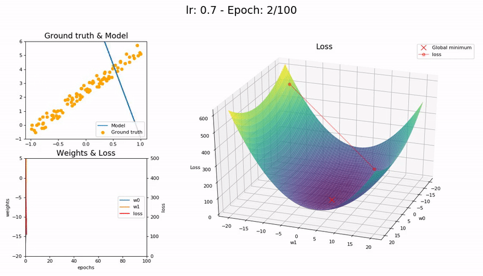

> TL;DR: `.fit_one_cycle()` uses large, cyclical, learning rates to train models significantly quicker and with higher accuracy.

Fastai provides two methods to train/fit a model: [`.fit()`](https://docs.fast.ai/basic_train.html#Learner.fit) and [`.fit_one_cycle()`](https://docs.fast.ai/basic_train.html#fit_one_cycle). It is recommended to use the latter due to its better performance in speed and accuracy. But, how does it work?

`.fit_one_cycle()` is Fastai's implementation of Leslie Smith's **1cycle learning rate policy**. Smith developed and publicised his methodology over three research papers:

1. [Cyclical Learning Rates for Training Neural Networks](http://arxiv.org/abs/1506.01186) (2017)
2. [Super-Convergence: Very Fast Training of Neural Networks Using Large Learning Rates](http://arxiv.org/abs/1708.07120) (2018)
3. [A disciplined approach to neural network hyper-parameters: Part 1 -- learning rate, batch size, momentum, and weight decay](http://arxiv.org/abs/1803.09820) (2018)

## The problem with Learning Rate

Training a Deep Neural Network (DNN) is a difficult global optimization problem. Learning Rate (LR) is a crucial hyper-parameter to tune when training DNNs. A very small learning rate can lead to very slow training, while a very large learning rate can hinder convergence as the loss function fluctuates around the minimum, or even diverges.

**Too small LR (0.01).** The model fails to converge within 100 epochs. More epochs--and time--required:

**Good LR (0.1).** The model converges successfully within 100 epochs:

**Optimal LR (0.7).** The model converges successfully, very quickly, in under 10 epochs:

**Large LR (0.99).** The model fails to converge as the loss function fluctuates around the minimum:

**Too large LR (1.01).** The model _diverges_ quickly:

<small>(Graphs by [José Fernández Portal](https://forums.fast.ai/t/share-your-work-here/27676/300))</small>

A low learning rate is slow but more accurate. As learning rate increases so does the training speed, until learning rate gets too large and diverges. Finding the sweet spot requires experimentation and patience. An automated way of calculating the optimal learning rate is to perform a [grid search](https://en.wikipedia.org/wiki/Hyperparameter_optimization#Grid_search), but this is a time consuming process.

In practice, learning rate is not static but changes as training progresses. It is desirable to start with an optimal learning rate (for speed) and gradually decrease it towards the end (for accuracy). There are two ways to achieve this: [learning rate schedules and adaptive learning rate methods](https://towardsdatascience.com/learning-rate-schedules-and-adaptive-learning-rate-methods-for-deep-learning-2c8f433990d1).

Learning rate schedules are mathematical formulas that decrease the learning rate using a particular strategy (Time-Based Decay, Step Decay, Exponential Decay, etc). That strategy/schedule is set before training commences and remains constant throughout the training process. Thus, learning rate schedules are unable to adapt to the particular characteristics of a dataset. Adaptive learning rate methods (Adagrad, Adadelta, RMSprop, Adam, etc) alleviate that problem but are computationally expensive. See "[An overview of gradient descent optimization algorithms](http://arxiv.org/abs/1609.04747)" (Ruder, 2016) for an in-depth analysis.

## Cyclical Learning Rates

Smith discovered a new method for setting learning rate, named [Cyclical Learning Rates](http://arxiv.org/abs/1506.01186) (CLRs). Instead of using a fixed, or a decreasing learning rate, the CLR method allows learning rate to continuously oscillate between _reasonable_ minimum and maximum bounds.

One CLR cycle consists of two steps; one in which the learning rate increases and one in which it decreases. Each step has a size (called _stepsize_), which is the number of iterations (e.g. 1k, 5k, etc) where the learning rate increases or decreases. Two steps form a cycle. Concretely, a CLR cycle with stepsize of `5,000` will consist of `5,000 + 5,000 = 10,000` total iterations. A CLR policy might consist of multiple cycles.

CLRs are not computationally expensive and eliminate the need to find the best learning rate value--the _optimal_ learning rate will fall somewhere between the minimum and maximum bounds. A cyclical learning rate produces better overall results, despite the fact that it might hinder the network performance temporarily.

The above figure shows the training accuracy of the CIFAR-10 dataset over 70,000 iterations. A fixed learning learning rate achieves 81.4% accuracy after 70,000 iterations, while the CLR method achieves the same within 25,000 iterations.

> "The essence of this learning rate policy comes from the observation that increasing the learning rate might have a short term negative effect and yet achieve a longer term beneficial effect." Smith

Cyclical Learning Rates are effective because they can successfully negotiate [saddle points](https://en.wikipedia.org/wiki/Saddle_point), which typically have small gradients (flat surfaces) and can slow down training when learning rate is small. The best way to overcome such obstacles is to speed up and to move fast until a curved surface is found. The increasing learning rate of CLRs does just that, efficiently.

')

### Learning Rate range test

Smith also devised a simple method for estimating reasonable minimum and maximum learning rate bounds; the **LR range test**. The test involves running a model for several epochs, where the learning rate starts at a low value and increases linearly towards a high value. A plot of the accuracy versus learning rate shows when the accuracy starts to increase and when it slows down, becomes ragged, or declines. The following LR range test plot shows two points that are good candidates for the minimum and maximum bounds:

Subsequently, a Cyclical Learning Rate policy that varies between these bounds will produce good classification results, often with fewer iterations and without any significant computational expense, for a range of architectures.

## Super-convergence

Building on his CLR research, Smith followed up with a [paper on Super-Convergence](http://arxiv.org/abs/1708.07120), a phenomenon where `neural networks can be trained an order of magnitude faster than with standard training methods`.

Super-Convergence uses the CLR method, but with just one cycle (that contains two LR steps, one increasing and one decreasing) and a very large maximum learning rate bound. This is called the `1cycle policy`.

Concretely, in Super-Convergence LR starts at a very low value--almost zero--, increases to a very large value and then decreases again. The effect of that LR movement is a very distinctive training accuracy curve. Traditional training accuracy curves increase, then plateau as the value of learning rate changes (see blue curve, below). Super-Convergence training accuracy curves (see red curve, below) have a dramatic initial jump (moving fast as LR increases), oscillate or even decline for a bit (while LR is very large) and then jump up again to a distinctive accuracy peak (as LR decreases to a very small value).

---

---

---

---

---

---

---

---

---

---

---

---

---

---

---

---

---

---

---

---

---

---

---

In these situations the network can be trained quickly with one learning rate cycle by using an unusually large learning rate. The very large learning rates used provided the twin benefits of regularization that prevented overfitting and faster training of the network. Figure 5a shows an example of super-convergence, where the training was completed in 10,000 iterations by using learning rates up to 3.0 instead of needing 80,000 iterations with a constant initial learning rate of 0.1.

The LR range test can be used to determine if super-convergence is possible for an architecture. In the LR range test, training starts with a zero or very small learning rate which is slowly increased linearly throughout a pre-training run. This provides information on how well the network can be trained over a range of learning rates.

The highest accuracies attained using standard learning rate schedules are listed in Table 6 and super-convergence test accuracy is 1.2%, 5.2%, and 9.2% better for 50,000, 20,000, and 10,000 training cases, respectively. Hence, super-convergence becomes more beneficial when training data is more limited.

Furthermore, I realized that a single run where the learning rate increased from a small value to a large value provides valuable insight as to the minimum, maximum, and optimal learning rate values. I called this the learning rate range test.
