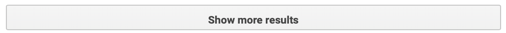
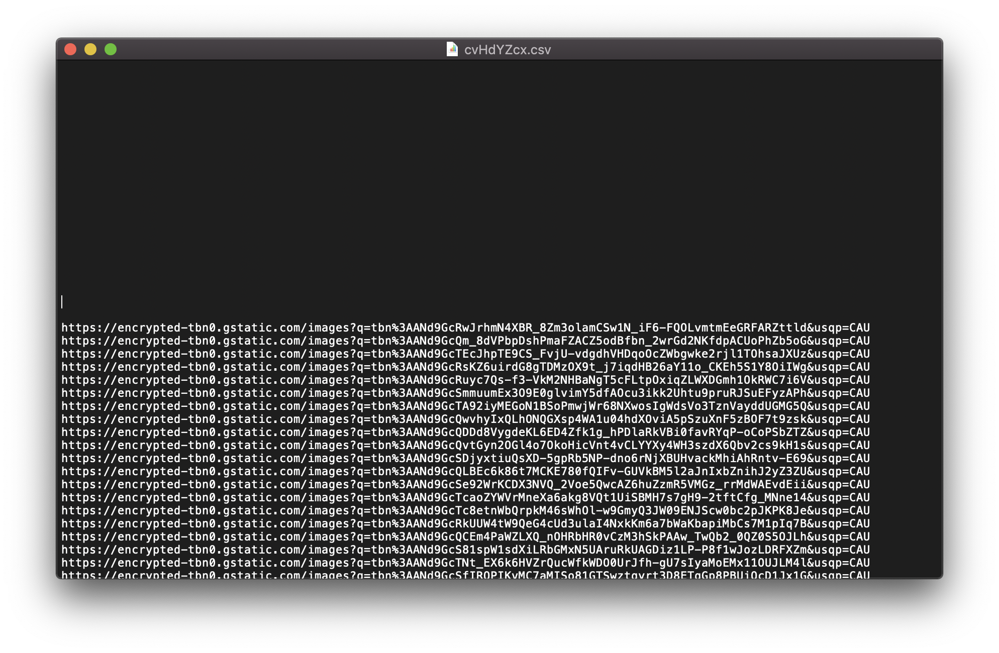
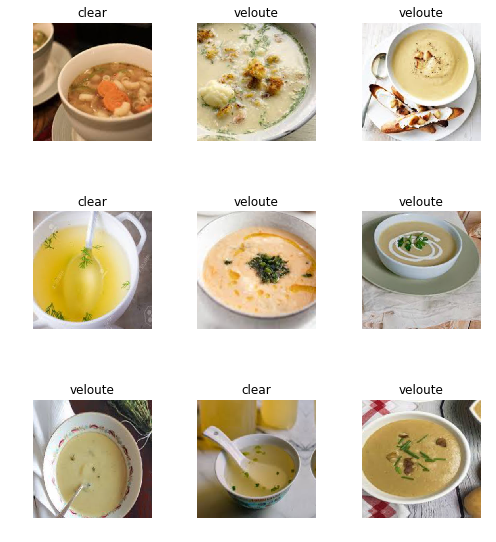

We humans don't learn everything from scratch when we study a new topic. Instead, we build on top of our existing knowledge. We even share--or _transfer_--"packaged" knowledge with one another in the form of research papers, books, articles, and more.

Computers can do the same. They can learn faster, more accurately, and with less data, using the same approach.

_Transfer Learning_ is a Machine Learning technique that allows us to leverage knowledge from previously trained models to train new models. We can use Transfer Learning to build image _and_ text models.

Say you want to create an app that can categorize images—an _image classifier_-based on their content, such as type (cars, people, food, toys, etc), color theme (blue, red, etc), and so on.

The amount of data that's needed for a task like that is surprisingly low!


In this article we'll learn a simple method to generate image datasets for Transfer Learning experiments.

We'll use Google Images to get a list of image URLs and process them in Python and [Fastai](https://github.com/fastai/fastai).

You can [download the Notebook](https://github.com/mavropalias/image-classifier/blob/master/dataset_creator.ipynb).

## This vs That

Pick a topic--any topic--that you want to classify images on, go to Google and search for images. For this example we'll create a dataset of _clear_ and _velouté_ (thick) soups, which we're going to use to build a model that can classify images of soups based on their viscosity (that will be a separate follow-up article).

### Step 1: Get a list of image URLs

Go to Google.com, search for "clear soup", select the _Images_ tab, and keep scrolling until you see the "Show more results" button:



You should now have ~300 images in the search results page. Our goal is to fetch all image URLs and put them in a CSV file. We'll then use that CSV file to download the images locally.

There's a very simple way to put all image URLs into a CSV file. Open the browser's console, paste the following command, and hit enter:

```javascript
urls = Array.from(document.querySelectorAll('.rg_i')).map(el =>
  el.hasAttribute('data-src')
    ? el.getAttribute('data-src')
    : el.getAttribute('data-iurl')
)
window.open('data:text/csv;charset=utf-8,' + escape(urls.join('\n')))
```

This will open a new browser window (your browser might block it, so just manually allow it if that happens) and it'll prompt you to save the CSV file. Give it an appropriate name, e.g. "clear.csv" and save it.

Now, follow the same process for all the remaining categories you want to use in your image classifier. In our case, search for "velouté soup" and save the URLs in _veloute.csv_.

### Step 2: Clean up the CSV files

You should now have a set of CSV files. Open them in a text editor, or spreadsheet app, and review their contents. It will look like this:



Notice the blocks of empty lines throughout the file. If that happens to you, just delete all empty lines. The remaining text is a list of URLs to download individual images.

### Step 3: Download dataset images

We're now ready to download all images locally. The following code will read our CSVs, and download images into `/veloute` and `/clear` folders. Modify `categories` to match your own, if required.

```python
from fastai.vision import *

# the categories of images that we want to classify
categories = ['veloute', 'clear']

# read all CSV files and download images
path = Path()
for cat in categories:
    dest = path/cat
    dest.mkdir(parents=True, exist_ok=True)
    download_images(path/'{}.csv'.format(cat), dest)

# verify downloaded images and delete broken ones
for cat in categories:
    print(cat)
    verify_images(path/cat, delete=True)
```

### Step 4: View data

We have now downloaded our dataset and are ready to view the data. We are going to create a Fastai `ImageDataBunch` and view a sample of our dataset:

```python
data = ImageDataBunch.from_folder(path, train=".", valid=".", valid_pct=0.2,
        ds_tfms=get_transforms(), size=300).normalize(imagenet_stats)

data.show_batch(rows=3, figsize=(7,8))
```



You might discover some odd images that are either misclassified, or plain wrong. This means that the ~300 images we got for each category from Google are not 100% correct. You can fix this manually, by removing of re-classifying the offending images, but that can be a strenuous process. We'll learn how to fix it more easily in a follow-up article.

Let's also take a look at our dataset details:

```python
print('Classes:', data.classes)
print('Train dataset size:', len(data.train_ds))
print('Validation dataset size:', len(data.valid_ds))
```

```bash
Classes: ['clear', 'veloute']
Train dataset size: 512
Validation dataset size: 128
```

Fastai took care of creating a train and validation dataset for us. Nice.

### Conclusion

You now have a dataset of different image categories ready for training! Stay tuned for a follow-up article where we're going to use this dataset to train an image classifier.
