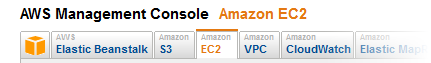
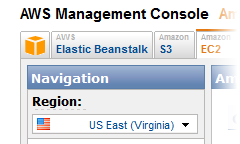
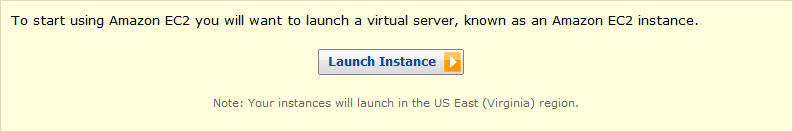
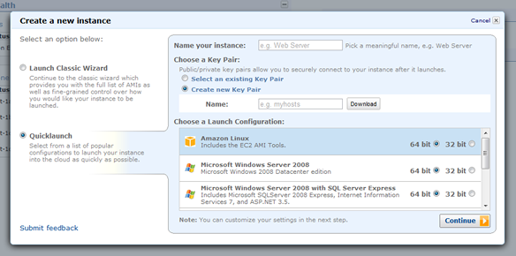
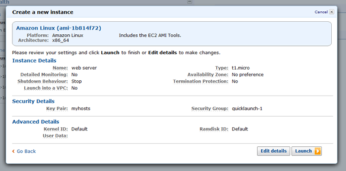
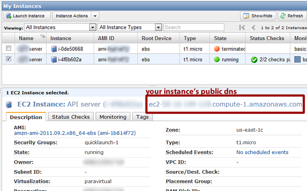
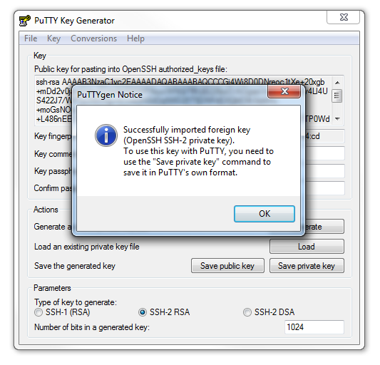
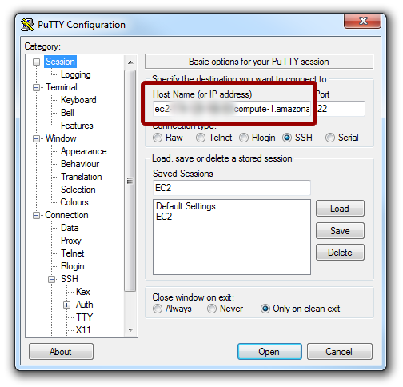
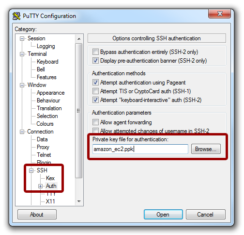
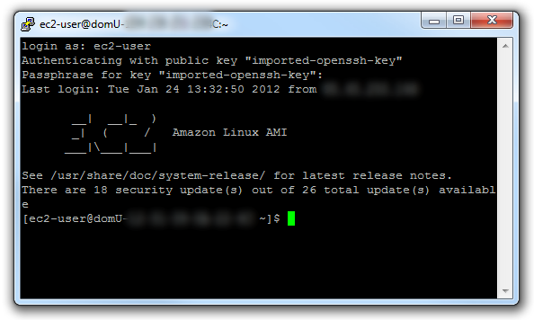

Confused about all those [Amazon AWS products](http://aws.amazon.com/products/)? Don't know where to begin and how to start working with Node.js in the cloud? This step-by-step guide will help you setup a new Amazon AWS EC2 instance and install Node.js with NPM.

> Update: you can speed up the Node.js setup process by using my [Node.js Amazon CloudFormation template](/node-js-amazon-cloudformation-template/).

Table of contents:

- [Create an Amazon Web Services (AWS) account](#createAccount)
- [Launch an EC2 instance (web server)](#launchInstance)
- [Connect to Amazon EC2 with Putty](#puttyConnect)
- [Update your EC2 Amazon Linux](#updateEC2)
- [Install Node.js and NPM on your Amazon EC2 instance](#installNode)
- [Next steps](#nextSteps)

## <span id="createAccount"></span> Create an Amazon Web Services (AWS) account

Create an [Amazon Web Services (AWS) account](https://aws-portal.amazon.com/gp/aws/developer/registration/index.html) (if you already have an Amazon.com account for shopping, you can use that).

## <span id="launchInstance"></span> Launch an EC2 instance (web server)

In order to install and run Node, we first need to have a web server. Amazon calls its web servers instances, because you can have many of them running in parallel. For now, you only need one instance.

Login with your AWS account and goto the [EC2 tab in the AWS Management Console](https://console.aws.amazon.com/ec2/home).



Before launching your web-server, Amazon gives you the option to choose a location. The cost varies between locations (although it's free for the first year). US East (Virginia) and US West (Oregon) were the cheapest ones when this article was published. You can [check the current prices](http://aws.amazon.com/ec2/pricing/) for yourselves at Amazon.



After choosing a location, click the big "Launch Instance" button (an EC2 instance is similar to a regular unmanaged web-server).



In the new popup, give a name to your instance, type any name for the key pair file and download it (more on it later). Then choose an AMI (Amazon Machine Image). I suggest [Amazon Linux](http://aws.amazon.com/amazon-linux-ami/) 64 bit, which is loosely based on CentOS and is tuned for security and performance in the cloud. I chose 64bit due to some compatibility issues between the 32bit version and some versions of Node.



There are community Linux AMIs that you can use, which have Node and other software pre-installed, but if you go with a clean installation and setup everything yourself, you'll learn how to administer and maintain it more easily (we'll cover the basics in a while).

Finally, in the next screen just hit _Launch_.



Your instance is now launching and may take a few minutes. Click the [View your instances on the Instances page](https://console.aws.amazon.com/ec2/home?#s=Instances) link in the last page in the popup and you will be redirected to the following page:



You can now use your instance's public dns to connect to your server via ssh. Amazon does not provide a custom username and password for ssh connections. Instead, they use the key pair file you created a couple of steps ago (a more secure practice).

## <span id="puttyConnect"></span> Connect to Amazon EC2 with Putty

If you're on Windows, you can use an ssh client like [Putty](http://www.chiark.greenend.org.uk/~sgtatham/putty/download.html):

- [Download Putty and puttygen](http://www.chiark.greenend.org.uk/~sgtatham/putty/download.html)
- Use puttygen to convert Amazon's .pem key pair file to .ppk file.
  - Start puttygen and select Load
  - Select view all files and pick the .pem file you download from Amazon.
    
  - Click OK and select Save Private Key A passphrase is not required but recommended for additional security.
- Connect with Putty.
  - Launch Putty and enter your instance's public dns address.
    
  - Navigate to Connection/SSH/Auth. Click Browse and select the .ppk file you exported from puttygen.
    
  - Finally, click _Open_. When the connection comes up for the first time, Putty will ask you if you want to save the server's credentials; click Yes. In the login as prompt, type ec2-user and then your passphrase key for your key pair (if any). You are now logged-in into your instance!
    

## <span id="updateEC2"></span> Update your EC2 Amazon Linux

Security updates are automatically applied on the initial boot of the AMI. Upon login, the Message of the Day (/etc/motd) indicates whether or not any additional updates are available. To install them, just type:

```bash
sudo yum update
```

Type **y** when prompted if this is ok and wait a few minutes for the updates to install.

## <span id="installNode"></span> Install Node.js and NPM on your Amazon EC2 instance

At last, it's time to install Node.js on your Amazon Linux! We are going to install some required packages to compile Node and get Node from its Github repo. Type the following:

```bash
sudo yum install gcc-c++ make
sudo yum install openssl-devel
sudo yum install git
git clone git://github.com/nodejs/node.git
cd node
```

Now you need to decide which version of Node you want to install. If you are going to use a framework like Express 3.x, you need Node v0.6.x. Just modify the first command line to suit your needs. You can view all available Node tags (versions) by typing git tag -l. The make command will take a while to complete (30+ minutes), so go make a coffee and come back later.

```bash
git checkout v0.6.8
./configure
make
sudo make install
```

Alright, Node is now installed! Let's add it to sudo's path so that we can install more packages. You will need to use the VI editor to edit the `/etc/sudoers` file. Type the following:

```bash
sudo su
vi /etc/sudoers
```

If you're not familiar with VI, do the following:

```bash
# Use the down keyboard arrow to find this line:
Defaults    secure_path = /sbin:/bin:/usr/sbin:/usr/bin

# Use the right arrow to move the cursor to the end of the line
# and press the INSERT button. Now type:
:/usr/local/bin

# In order to save your changes and exit VI, hit ESC and type:
:

# now type:
wq!

# and you're back in the console
# in order to leave su mode, type:
exit
```

The next step is to install NPM(Node package manager). Type the following commands:

```bash
git clone https://github.com/isaacs/npm.git
cd npm
sudo make install
```

## Congratulations!

You now have a working Amazon EC2 instance with Node.js and NPM! You can install additional Node packages using NPM:

```bash
sudo npm install express -g
sudo npm install forever -g
```

## <span id="nextSteps"></span> Next steps

If everything went according to plan, here are a few things that you should/could do:

1. [Save your customised Amazon EC2 instance](http://docs.amazonwebservices.com/gettingstarted/latest/wah-linux/getting-started-create-custom-ami.html) as an Amazon Machine Image (AMI) and launch future environments with this saved configuration.
2. Read some [tips on securing your EC2 instance](http://aws.amazon.com/articles/1233).

## Conclusion

I hope this guide was useful. If you have any comments, suggestions or additional tips that could be added to the guide, please let me know in the comment section below.
