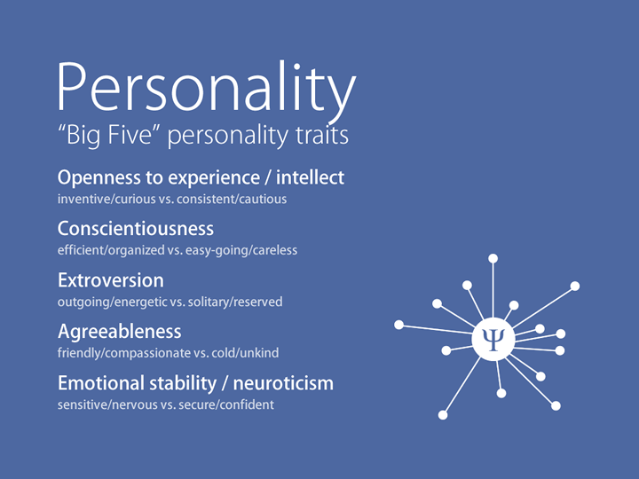
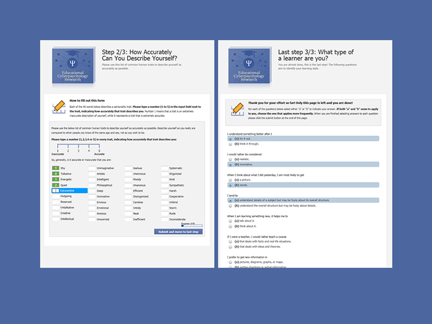

A few weeks ago, I presented my chapter from the upcoming Cyberpsychology book 'The Psychology of New Media' at the IADT in Dún Laoghaire, as part of Innovation Dublin 2012. As promised, here are the slides from the presentation, along with a few notes for people that were not able to attend the event.

Online learning applications are becoming popular and ubiquitous, a trend that will continue to grow in the coming years.

Many of these modern learning applications take advantage of technological and pedagogical breakthroughs to identify the preferences and personality characteristics of their student and adapt the learning experience towards the needs of the individual.

An adapted learning experience, customised to the personality, learning style and preferences of students, can enhance the user experience, engagement levels and, crucially, their learning outcome.

This is typically done by assessing a number of metrics and characteristics of the individual, and consequently adapting the learning material that each student is provided with.

The student's personality and learning style are two predominant characteristics used in such intelligent learning systems.

In developing user models, two techniques have been predominately used to identify learning styles and personality characteristics: questionnaires and ongoing behaviour and performance monitoring.

The problem is that both techniques have significant drawbacks. Questionnaires must be completed in advance of a student using an e-learning app and can only provide data from a single point in time.

On the other hand, behaviour and performance monitoring occurs transparently, during the learning process, but it can be slow to produce useful results.

So, what can we do to fix that?

The problem is really a matter of collecting reliable data about the student. The ideal way would be to gather the data without annoying the student and with no delays, in order to provide instant personalisation.

I believe that the social web can provide us with such data.

Every single day, we discover new things, communicate, interact and visit new places. A good deal of all that is reflected in our online social activity, where we share much of what goes on in our lives.

In Facebook alone, people create 30 billion pieces of content each month! Twitter users post hundreds of millions of tweets every single day. And, of course, there are hundreds of other social networks where people engage with each other and share content.

Are these just random data, or digital traces of ourselves? I believe that the things we share have a meaning to us and can even describe and define us.

I call these things our Social Bits: “activity, information & content shared online by people”.

My study's aim was to explore and decode our Social Bits, with the goal of discovering aspects of our personalities and learning styles within them.

When it comes to measures of personality factors and the social web, no research outside of Facebook exists to-date. Moreover, only a few studies so far have shed light on how personality factors relate with the way people use Facebook.

These studies produced some very interesting findings, linking our true personalities with our online profiles and the way we behave in social networks.

However, studies on the social web have been limited in certain aspects, like only using homogeneous samples (for example, only female participants), self reports to collect data, or only focusing on one social network at a time, limiting the level to which these results can be extrapolated.

My goal was to do a more fine-grained analysis of multiple Facebook aspects, while at the same time incorporating data from other social websites, in order to produce a more complete profile of people that use such sites.

To that end, I developed a simple exploratory hypothesis:

> The online social networking activity of individuals as measured by their social bits has a significant correlation with personality characteristics and learning style attributes.

Personality is typically measured in 5 areas or traits:

- openness to experience / intellect
- conscientiousness
- extroversion
- agreeableness
- emotional stability / neuroticism

Learning styles describe how we like to learn and there are many variations of them. A popular one, the one I used, is the Index of Learning Styles and describes learning in 4 dimensions:

- active / reflective
- sending / intuitive
- visual / verbal
- sequential / global

For my study I recruited an international sample of 121 people from 21 countries. The study was done online and open to adults that were users of at least one of these 6 websites.

I used convenience and snowball sampling techniques to recruit people, by inviting friends, family and colleagues, running an ad campaign on Google Ad network and encouraging participants to invite their peers.

I promise that the split between males and females was completely random!

The measures I used to assess people was the English Mini-Markers scale to measure the big-five factors of personality, and the Index of Learning Styles to measure their learning inclinations.

For the needs of the study I developed a website and 6 applications, one for each of the websites I used in the study, to collect a large amount of data automatically.

And now, the results! Due to the large amount of data, I had to find a creative way of presenting all the correlations that were detected.

Wherever you see a green cross (+) it means that there is a positive correlation ( p < 0.05) between that item and it's header. A red dash (-) means that is a negative correlation. A double symbol (++ / --) means that the possibility of that results to have been produced due to pure chance, is less than 1% ( p < 0.01).

To sum up, my study investigated whether we can use the social web to predict people's personalities and learning styles. The results suggest that we can, and are in line with findings from previous studies.

For example, LinkedIn and Flickr users were more likely to fall in the intuitive side of the sensing/intuitive learning dimension. As Felder and Silverman explain, intuitive learners often prefer discovering possibilities and relationships, they like innovation and dislike repetition, and are better at grasping new concepts. Notably, LinkedIn and Flickr users were also found to be more open to experience, indicating a level of overlap between the findings of the personality test and the learning style test.

I believe that the social web can be an important tool in intelligent learning applications, and other types of applications, that could be used in parallel with other methods to enhance the effectiveness of customisation and adaptation of a user's experience.

A more detailed version of my findings, will be published in the Psychology of the New Media book, which is going to be released Q1/Q2 of 2013.

