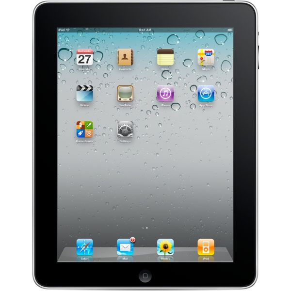

The following comments were posted online by disappointed users the day Apple announced its new product:

> "I was so hoping for something more."

> "Great just what the world needs, another freaking ...."

> "I still can't believe this! All this hype for something so ridiculous! ... I want something new! I want them to think differently!"

> "It wont sell, and be killed off in a short time...and it's not really functional"

> "Break-through digital device? The Reality Distortion Field™ is starting to warp Steve's mind if he thinks for one second that this thing is gonna take off."

> "I have a \*\*\* and \*\*\* already, and besides that now that I don't have a \*\*\* job anymore I need that \$ to pay car payments and rent."

> "The reason why everyone is disappointed is because we had our hopes up for this incredible device that would do everything you could possibly use the word digital in and most of the things you can't do."

Why so much negativity?

## A case of Déjà vu

It is a bit ironic that the above comments ([posted here](http://forums.macrumors.com/showthread.php?t=500)) do not refer to the new iPad, but to the iPod mp3 player, which was launched in 2004 and since then _over 250 million units_ have been sold. In fact, iPods have won several awards ranging from engineering excellence, to most innovative audio product, to fourth best computer product of 2006. Furthermore, iPods often receive favourable reviews; scoring on looks, clean design, and ease of use.

Similarly, when the -- now successful -- iPhone was released, people criticised Apple for releasing a phone with such limited features (no camera at first, no copy & paste for text and no multitasking, among other limitations).

A month ago Apple announced the iPad, "The best way to experience the web, email photos and video. Hands down" as they like to call it. But is it really the best experience, and for whom?

I will not go over the pros and cons of the iPad, there are [tons](http://www.engadget.com/2010/01/27/apple-ipad-first-hands-on/) of [preview](http://mashable.com/2010/01/27/ipad/) [articles](http://www.techradar.com/news/mobile-computing/portable-computing/hands-on-apple-ipad-review-666884) [already](http://www.digitaltrends.com/computing/mac-computing/apple-ipad-impressions-the-skeptics-take/). What I find interesting is the obvious pattern on user perception and acceptance every time Apple releases a new product.

People get hyped, excited, disappointed and critical of every new product, which ends-up being a success, nevertheless. Advanced / Power users are the main source of negative comments.

## Embrace your weakness

The defining characteristic of Apple's products is _simplicity_. While many people criticise what the iPad does not do, Apple embraces the very same characteristic: _simplicity_ and _usability_.

> Users criticise what the product does not do (lack of features)

> Apple embraces simplicity (easy to use).

With the explosion of media consumption over the internet and the increasing number of new internet users, the iPad couldn't have come at a better time. There is a huge market with people that want to consume digital content and they are either not familiar with the technology or just do not care about the technicalities.

## "What is a browser?"

Sometimes during the design process of a product/website, we tend to make a mistake: assumptions and over-simplifications about the users ("they will be able to figure this out", "they will like all these extra features", etc). It's interesting and frightening how disconnected designers can become with their target audience.

Two recent events came to my mind when I was trying to figure out Apple's goal with the iPad. When Google released its browser, Google Chrome, they did a survey in New York, asking people "what is a browser?". Watch the results:

`youtube: https://www.youtube.com/watch?v=o4MwTvtyrUQ`

Along the same lines, in early February, ReadWriteWeb published an article titled [Facebook Wants to Be Your One True Login](http://www.readwriteweb.com/archives/facebook_wants_to_be_your_one_true_login.php). Now, ReadWriteWeb is a popular website focusing on web trends and technologies and when this article was published it managed to get a very high ranking in Google search results for the term "facebook login". This lead to hundreds of people that used Google to access Facebook (i.e. googling "Facebook", instead of typing `facebook.com` in the browser) ending up in ReadWriteWeb, complaining because they couldn't log in to their Facebook page and see their friends. They actually thought that ReadWriteWeb _was_ Facebook, with a new design.

## iPad's focus on user goals

Unfortunately, people unfamiliar with technology exist even in developed countries and although I do not believe that designers should over-simplify their applications just for inexperienced users, there are always creative ways to develop interactions and environments that are easy and fun to use.

It's clear that Apple it trying to tap into this market of people that do not care about platforms, plugins and updates, but are only interested in achieving their goals. This is where the iPad excels and I believe that it sets the bar on creative Human-Computer Interaction and Usability design, providing a welcoming, captivating and fun User Experience. The challenge for Apple is to convince power users in adopting the iPad (or simply ignore them?).

Here's a interesting example of a 2.5 year old girl using the iPad, instinctively:

`youtube: https://www.youtube.com/watch?v=pT4EbM7dCMs`
